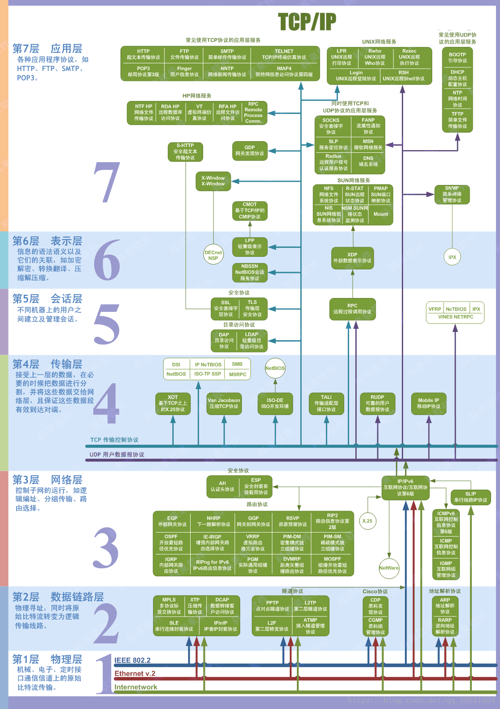

## 1. 协议及协议栈的基本概念

### 1.1、什么是协议？

协议是网络中计算机或者设备之间进行通信的一系列规则的集合。通常协议有 IP、TCP、HTTP、POP3、SMTP 等

### 1.2、什么是协议栈？

在网络中，为了完成通信，必须使用多层上的多种协议。这些协议按照层次顺序组合在一起，构成了协议栈（Protocol Stack），也称之为协议族（Protocol Suite）

### 1.3、协议的作用：

一个网络协议的作用主要有两个：

1. 建立对等层之间的虚拟通信
2. 实现层次之间的无关性

### 1.4、层次间的无关性

所谓层次间的无关性，就是指较高层次和相邻层次进行通信时，只是利用较低层次提供的接口和服务，而不需要了解底层实现该功能所采用的算法和协议的细节；较低恩赐也仅是使用从高层系统传来的参数和控制信息，这就是层次间的无关性。

## 2. 网络协议族/栈组成

网络通信协议的作用是负责在网络上建立通信通道和控制通过通道的信息流的规则。为了进行网络通信，通信双方必须遵守通信协议。

> 说明：网络协议与标准是给予 OSI 七层模型，每一层有其对应的协议

OSI 引入了服务、接口、协议、分层的概念，TCP/IP 借鉴了 OSI 的这些概念建立 TCP/IP 模型。

OSI 先有模型，后有协议，先有标准，后进行实践；而 TCP/IP 则相反，先有协议和应用再提出了模型，且是参照的 OSI 模型。

OSI 是一种理论下的模型，而 TCP/IP 已被广泛使用，成为网络互联事实上的标准。

- TCP：transmission control protocol 传输控制协议
- UDP：user data protocol 用户数据报协议
  

**OSI 七层和 TCP/IP 的区别**

TCP/IP 他是一个协议簇；而 OSI（开放系统互联）则是一个模型，且 TCP/IP 的开发时间在 OSI 之前。

TCP/IP 是由一些交互性的模块做成的分层次的协议，其中每个模块提供特定的功能；OSi 则指定了哪个功能是属于哪一层的。

TCP/IP 是五层结构，而 OSI 是七层结构。OSI 的最高三层在 TCP 中用应用层表示。

### 3. 常见网络协议

`TCP/IP`:工业标准、开放式协议。Internet 网络的标准
`IPX/SPX`:Novell 开发的 Netware 操作系统使用的协议，IPX 为网际数据包交换协议，工作在网络层，SPX 为序列数据包交换协议，工作在传输层
`NetBIOS/NetBEUI`:较小的协议栈，应用于 IBM 和早期的 Windows 系统，现在 Window 任然支持
`AppleTalk`：Apple 公司的 Mac OS 中采用的网络协议

（1）、TCP/IP 协议

TCP/IP 是分层协议，如层次图所示：从底层到应用层，分别为物理层，链路层，网络层，传输层，应用层。
数据时层层封装，封装的方式一般都是在原有的数据面前加一个数据控制头

（2）、Telnet 协议
`Telnet` 是 TCP/IP 中的一种应用协议，可以为终端仿真提供支持。
可是用户连接到主机上，使主机响应起来就像它直接连接在终端上一样。
Telnet 在发送端和接收端使用 TCP 的 23 号端口以进行专用的通信

（3）、FTP 协议

FTP 协议使用的 TCP20 号和 21 号端口，20 号端口用于数据交换，21 号端口用于建立连接，允许目录和文件访问，上传下载，不能远程执行文件
TFTP 使简单文件传输协议（Trivial File Transger Protocol），TFTP 是无连接的，使用 UDP 的 69 号端口，用与当数据传输错误无关紧要而且无需安全性时的小型文件的传输

（4）、STMP 协议

SMTP 时简单邮件传输协议（Simple Mail Transfer Protocol）是为网络系统间的电子邮件交换而设计的。
使用 25 端口，SMTP 只需要在接收端的一个电子邮件地址即可发送邮件。
POP3 协议用来接收右键。使用 110 端口

（5）、DNS 服务

DNS 时域名解析服务（Domain Name Service），作用是将域名转换为 IP 地址，或将 IP 地址转换为域名，用于解析完全合格的域名（FQDN）。
使用 53 号端口。

（6）、DHCP 服务

DHCP 时动态主机配置协议，服务器可以提供的信息有：

1. IP 地址
2. 子网掩码（subnet mask）
3. 域名（domain name）
4. 默认网关（default gateway）
5. DNS
