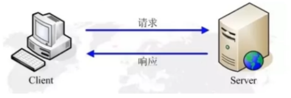
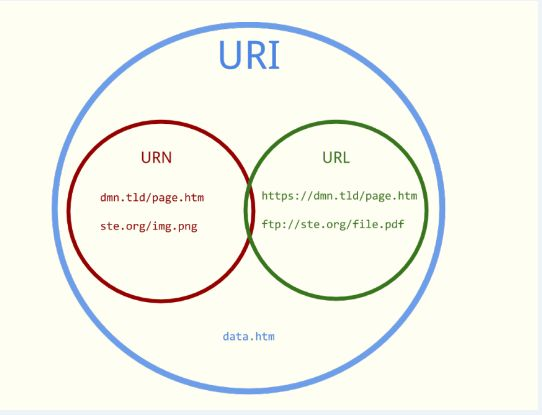
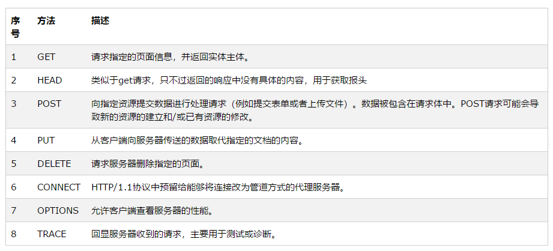

## HTTP 协议

HTTP 协议是（Hyper Text Transfer Protocol，超文本传输协议），是用于万维网（WWW：World Wide Web）服务器传输超文本到本地浏览器的传送给协议。

HTTP 是一个居于 TCP/IP 通信协议来传递数据（HTML，文件，图片，查询结构等）。

HTTP 是一个属于应用层的面向对象的协议，由于其简捷，适用于发布超媒体信息系统。它与 1990 年提出，经过几年的使用和发展，得到不断地完善和扩展。目前在 WWW 中使用的是 HTTP/1.0 的第六版，HTTP/1.1 的规范化工作还在进行，而且 HTTP-NG（Next Generation of HTTP）的建议

HTTP 协议工作于客户端-服务端架构上。浏览器作为 HTTP 客户端通过 URL 向 HTTP 服务端即 WEB 都武器发送所有请求。Web 服务器根据接收到的请求后，向客户端发送响应信息。



### HTTP 协议的主要的特点

1. 简单快速：客服向服务器请求服务时，只需传送请求方法和路径。请求方法常用的为：GET、PUT、POST。每种方法规定了客户与服务器联系的类型不同。由于 HTTP 协议简单，使用 HTTP 服务器的程度规模小，因而通信速度很快。

2. 灵活：HTTP 允许传输任意类型的数据对象。正在传输的类型由 Content-Type 加以标记。

3. 无连接：是限制每次链接只处理一个 i 请求。服务器处理完客户的请求，并接收到客户的应答后，即断开连接。采用这种方式可以节省传输事件。

4. 无状态：HTTP 协议是无状态的协议。无状态是指子恶意对于事务处理没有记忆能力。缺少状态意味着如果后续处理需要前面的信息时，必须重新传输，这样可能导致每次链接传送的数据量增大。另一方面，在服务器不需要先前信息时它的应答就会很快

5. 支持 B/S 及 C/S 模式。

### HTTP 协议和 URL 的关系

HTTP 使用统一资源标识符（Uniform Resource Identifiers，URL）来传输数据和建立连接。URL 时一种特殊类型的 URI，包含了用来查找某个资源的足够信息。

URL，全称为：Uniform Resource Locator；中文叫统一资源定位符，是互联网上用来表示某一处资源的地址。

```bash
http://www.baidu.com/news/home.html?page=1&title=xxxxx&ID=123123123#name
```

**一个完整的 URL 的部分：**

1. 协议部分：该 URL 的写一部分为：“http”，代表着网页使用的是 HTTP 协议。在 Internet 中可以使用很多种协议，Ex：FTP，HTTPS 等。且 HTTP 后面必须以 "//" 分隔符隔开

2. 域名部分：该 URL 的域名部分为："www.baidu.com"。一个URL中，也可以使用IP地址作为域名使用。

3. 端口部分：跟在域名后面的端口，域名和端口之间使用 ":" 分隔。端口不是一个 URL 必须部分，如果省略了，那么会使用默认端口。

4. 虚拟目录部分：从域名后的第一个"/" 开始到最后一个 "/" 为止，是虚拟目录部分。虚拟目录也不是一个 URL 必须的部分。本例中为 "/news/"

5. 文件名部分：从域名后的最后一个 "/" 到开始的 "?" 为止，是文件名部分，如果没有 "?" 则是从域名后的最后一个 "/" 开始到 "#" 为止，是文件部分，如果没有 "?" 和 "#"， 那么从域名后的最后一个 "/" 开始到结束都是文件名部分。本例中为："home.html"。文件名部分不是一个 URL 必须的部分，如果省略该部分，则为默认文件名。

6. 锚部分：从 "#" 开始到最后，都是锚的部分 "#name",不是必须的

7. 参数部分：从 "?" 开始到 "#" 为止之间的部分为参数部分，又称搜索部分、查询部分。本例中为："page=1&title=xxxxx&ID=123123123"。参数可以允许多个，其规定写法为："key1=value1&key2=value2" ，之间必须以 "&" 分隔。

### URI 和 URL 的区别

1. URI
   Web 上可用的每种资源如 HTML 文档、图像、视频片段、程序等都是一个来 URI 来定位的；

URI 一般由三部组成：

- 访问资源的命名机制
- 存放资源的主机名
- 资源自身的名称，由路径表示，着重强调于资源。

2. URL
   URL 是 Internet 上用来描述信息资源的字符串，主要用在各种 WWW 客户程序和服务器程序上，特别是著名的 Mosaic。
   采用 URL 可以用一种统一的格式来描述各种信息资源，包括文件、服务器的地址和目录等。

URL 一般由三部组成：

- 协议(或称为服务方式)
- 存有该资源的主机 IP 地址(有时也包括端口号)
- 主机资源的具体地址。如目录和文件名等

3. URN
   Uniform Resource Name，统一资源命名，是通过名字来标识资源，比如 mailto:java-net@java.sun.com
   URL 的一种更新形式，统一资源名称(URN, Uniform Resource Name)不依赖于位置，并且有可能减少失效连接的个数。
   但是其流行还需假以时日，因为它需要更精密软件的支持。



### HTTP 请求消息 Request

客户端发送一个 HTTP 请求到服务器的请求消息包括一下格式：

**请求行（request line）、请求头部（header）、空行和请求数据四个部分组成。**


1. 请求头

请求行由请求方法字段、URL 字段和 HTTP 协议版本字段 3 个字段组成，它们用空格分隔。例如，GET /index.html HTTP/1.1。
HTTP 协议的请求方法有 GET、POST、HEAD、PUT、DELETE、OPTIONS、TRACE、CONNECT。
而常见的有如下几种：

1).GET

最常见的一种请求方式，当客户端要从服务器中读取文档时，当点击网页上的链接或者通过在浏览器的地址栏输入网址来浏览网页的，使用的都是 GET 方式。GET 方法要求服务器将 URL 定位的资源放在响应报文的数据部分，回送给客户端。使用 GET 方法时，请求参数和对应的值附加在 URL 后面，利用一个问号（“?”）代表 URL 的结尾与请求参数的开始，传递参数长度受限制。例如，/index.jsp?id=100&op=bind,这样通过 GET 方式传递的数据直接表示在地址中，所以我们可以把请求结果以链接的形式发送给好友。以用 google 搜索 domety 为例，Request 格式如下：

```request
GET /search?hl=zh-CN&source=hp&q=domety&aq=f&oq= HTTP/1.1
Accept: image/gif, image/x-xbitmap, image/jpeg, image/pjpeg, application/vnd.ms-excel, application/vnd.ms-powerpoint,
application/msword, application/x-silverlight, application/x-shockwave-flash, */*
Referer: <a href="http://www.google.cn/">http://www.google.cn/</a>
Accept-Language: zh-cn
Accept-Encoding: gzip, deflate
User-Agent: Mozilla/4.0 (compatible; MSIE 6.0; Windows NT 5.1; SV1; .NET CLR 2.0.50727; TheWorld)
Host: <a href="http://www.google.cn">www.google.cn</a>
Connection: Keep-Alive
Cookie: PREF=ID=80a06da87be9ae3c:U=f7167333e2c3b714:NW=1:TM=1261551909:LM=1261551917:S=ybYcq2wpfefs4V9g;
NID=31=ojj8d-IygaEtSxLgaJmqSjVhCspkviJrB6omjamNrSm8lZhKy_yMfO2M4QMRKcH1g0iQv9u-2hfBW7bUFwVh7pGaRUb0RnHcJU37y-
FxlRugatx63JLv7CWMD6UB_O_r
```

可以看到，GET 方式的请求一般不包含”请求内容”部分，请求数据以地址的形式表现在请求行。地址链接如下：

```html
<a href="http://www.google.cn/search?hl=zh-CN&source=hp&q=domety&aq=f&oq="
  >http://www.google.cn/search?hl=zh-CN&source=hp &q=domety&aq=f&oq=</a
>
```

地址中”?”之后的部分就是通过 GET 发送的请求数据，我们可以在地址栏中清楚的看到，各个数据之间用”&”符号隔开。显然，这种方式不适合传送私密数据。另外，由于不同的浏览器对地址的字符限制也有所不同，一般最多只能识别 1024 个字符，所以如果需要传送大量数据的时候，也不适合使用 GET 方式。

2).POST

对于上面提到的不适合使用 GET 方式的情况，可以考虑使用 POST 方式，因为使用 POST 方法可以允许客户端给服务器提供信息较多。POST 方法将请求参数封装在 HTTP 请求数据中，以名称/值的形式出现，可以传输大量数据，这样 POST 方式对传送的数据大小没有限制，而且也不会显示在 URL 中。还以上面的搜索 domety 为例，如果使用 POST 方式的话，格式如下：

```
POST /search HTTP/1.1
Accept: image/gif, image/x-xbitmap, image/jpeg, image/pjpeg, application/vnd.ms-excel, application/vnd.ms-powerpoint,
application/msword, application/x-silverlight, application/x-shockwave-flash, */*
Referer: <a href="http://www.google.cn/">http://www.google.cn/</a>
Accept-Language: zh-cn
Accept-Encoding: gzip, deflate
User-Agent: Mozilla/4.0 (compatible; MSIE 6.0; Windows NT 5.1; SV1; .NET CLR 2.0.50727; TheWorld)
Host: <a href="http://www.google.cn">www.google.cn</a>
Connection: Keep-Alive
Cookie: PREF=ID=80a06da87be9ae3c:U=f7167333e2c3b714:NW=1:TM=1261551909:LM=1261551917:S=ybYcq2wpfefs4V9g;
NID=31=ojj8d-IygaEtSxLgaJmqSjVhCspkviJrB6omjamNrSm8lZhKy_yMfO2M4QMRKcH1g0iQv9u-2hfBW7bUFwVh7pGaRUb0RnHcJU37y-
FxlRugatx63JLv7CWMD6UB_O_r

hl=zh-CN&source=hp&q=domety
```

可以看到，POST 方式请求行中不包含数据字符串，这些数据保存在”请求内容”部分，各数据之间也是使用”&”符号隔开。POST 方式大多用于页面的表单中。因为 POST 也能完成 GET 的功能，因此多数人在设计表单的时候一律都使用 POST 方式，其实这是一个误区。GET 方式也有自己的特点和优势，我们应该根据不同的情况来选择是使用 GET 还是使用 POST。

3).HEAD

HEAD 就像 GET，只不过服务端接受到 HEAD 请求后只返回响应头，而不会发送响应内容。当我们只需要查看某个页面的状态的时候，使用 HEAD 是非常高效的，因为在传输的过程中省去了页面内容。

2. 请求头部

请求头部由关键字/值对组成，每行一对，关键字和值用英文冒号“:”分隔。请求头部通知服务器有关于客户端请求的信息，典型的请求头有：

User-Agent：产生请求的浏览器类型。

Accept：客户端可识别的内容类型列表。

Host：请求的主机名，允许多个域名同处一个 IP 地址，即虚拟主机。

3. 空行

最后一个请求头之后是一个空行，发送回车符和换行符，通知服务器以下不再有请求头。

4. 请求数据

请求数据不在 GET 方法中使用，而是在 POST 方法中使用。POST 方法适用于需要客户填写表单的场合。与请求数据相关的最常使用的请求头是 Content-Type 和 Content-Length。

**HTTP 报文**

HTTP 响应也由三个部分组成，分别是：状态行、消息报头、响应正文。

如下所示，HTTP 响应的格式与请求的格式十分类似：

＜ status-line ＞

＜ headers ＞

＜ blank line ＞

[＜ response-body ＞]

正如你所见，在响应中唯一真正的区别在于第一行中用状态信息代替了请求信息。状态行（status line）通过提供一个状态码来说明所请求的资源情况。

状态行格式如下：

HTTP-Version Status-Code Reason-Phrase CRLF

其中，HTTP-Version 表示服务器 HTTP 协议的版本；Status-Code 表示服务器发回的响应状态代码；Reason-Phrase 表示状态代码的文本描述。状态代码由三位数字组成，第一个数字定义了响应的类别，且有五种可能取值。

1xx：指示信息--表示请求已接收，继续处理。
2xx：成功--表示请求已被成功接收、理解、接受。
3xx：重定向--要完成请求必须进行更进一步的操作。
4xx：客户端错误--请求有语法错误或请求无法实现。
5xx：服务器端错误--服务器未能实现合法的请求。
常见状态代码、状态描述的说明如下。

200 OK：客户端请求成功。
400 Bad Request：客户端请求有语法错误，不能被服务器所理解。
401 Unauthorized：请求未经授权，这个状态代码必须和 WWW-Authenticate 报头域一起使用。
403 Forbidden：服务器收到请求，但是拒绝提供服务。
404 Not Found：请求资源不存在，举个例子：输入了错误的 URL。
500 Internal Server Error：服务器发生不可预期的错误。
503 Server Unavailable：服务器当前不能处理客户端的请求，一段时间后可能恢复正常，举个例子：HTTP/1.1 200 OK（CRLF）。

### HTTP 请求的方法：

HTTP/1.1 协议中共定义了八种方法（有时也叫“动作”），来表明 Request-URL 指定的资源不同的操作方式

HTTP1.0 定义了三种请求方法： GET, POST 和 HEAD 方法。

HTTP1.1 新增了五种请求方法：OPTIONS, PUT, DELETE, TRACE 和 CONNECT 方法



### TTP 工作原理

HTTP 协议定义 Web 客户端如何从 Web 服务器请求 Web 页面，以及服务器如何把 Web 页面传送给客户端。HTTP 协议采用了请求/响应模型。客户端向服务器发送一个请求报文，请求报文包含请求的方法、URL、协议版本、请求头部和请求数据。服务器以一个状态行作为响应，响应的内容包括协议的版本、成功或者错误代码、服务器信息、响应头部和响应数据。

HTTP 请求/响应的步骤：
客户端连接到 Web 服务器->发送 Http 请求->服务器接受请求并返回 HTTP 响应->释放连接 TCP 连接->客户端浏览器解析 HTML 内容

1. **客户端连接到 Web 服务器**
   一个 HTTP 客户端，通常是浏览器，与 Web 服务器的 HTTP 端口（默认为 80）建立一个 TCP 套接字连接。例如，http://www.baidu.com

2. **发送 HTTP 请求**
   通过 TCP 套接字，客户端向 Web 服务器发送一个文本的请求报文，一个请求报文由请求行、请求头部、空行和请求数据 4 部分组成。

3. **服务器接受请求并返回 HTTP 响应**
   Web 服务器解析请求，定位请求资源。服务器将资源复本写到 TCP 套接字，由客户端读取。一个响应由状态行、响应头部、空行和响应数据 4 部分组成。

4. **释放连接 TCP 连接**
   若 connection 模式为 close，则服务器主动关闭 TCP 连接，客户端被动关闭连接，释放 TCP 连接;若 connection 模式为 keepalive，则该连接会保持一段时间，在该时间内可以继续接收请求;

5. **客户端浏览器解析 HTML 内容**
   客户端浏览器首先解析状态行，查看表明请求是否成功的状态代码。然后解析每一个响应头，响应头告知以下为若干字节的 HTML 文档和文档的字符集。客户端浏览器读取响应数据 HTML，根据 HTML 的语法对其进行格式化，并在浏览器窗口中显示。
