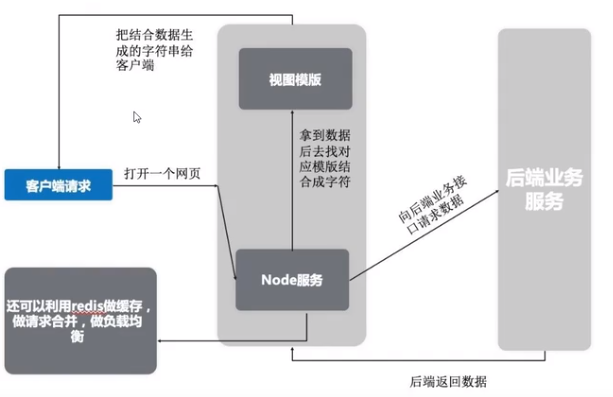
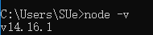
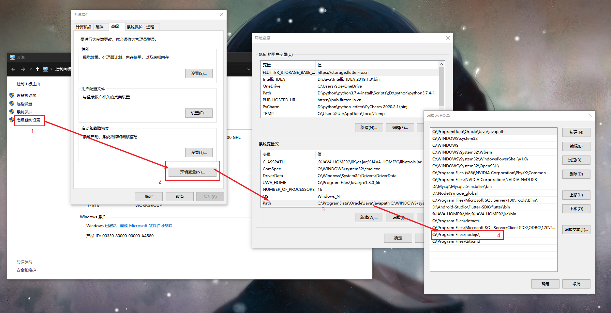

# Node 学习日志

## day01 的 Node 学习基础

### **介绍：**

Node.js 诞生于 2009 年，是由 Joyent 的员工 Ryan Dahl（一个 C/C++的写高性能 Web 服务的专家） 开发的。
JavaScript 是单线程执行,不能进行同步 IO 操作,这一"缺陷"导致只能使用异步 IO.
Node.js 不是一门语言也不是框架，他只是基于 Google V8 引擎的 javascript 运行时环境，同时杰克了 Libuv 扩展了 javaScript 功能，使之支持 io，fs 等只有语言才有的特性。
使得 JS 能够同时具有 DOM 操作（浏览器）和 I/O、文件读写、操作数据库（服务器端）等能力
目前最简单的全栈式语言
例如：Web 开发、微服务、前端构建
网址：https://www.npmjs.com/

NodeJS 特点：

- **事件驱动**：当触发某个事件的时候，执行事件中指定的代码！
- **非阻塞 IO 模型（异步）**：采用非阻塞的操作，能够提高处理的效率！
- **轻量和高效**

（Node 的运行环境中封装了一些方法是的 JS 可以对数据库进行 CRUD 操作）

---

### **Node 的运用**

前端负责用户页面，后端负责提供数据和业务接口。
现在我们在两者间加入一层，前端并不是直接去请求后端业务接口，而是请求到中间层。
再由中间层去请求业务接口



这个流程可以描述为：客户端直接请求到中间层的 Node 服务，Node 服务分析请求，看需要哪个页面，再去请求对应数据
拿到数据后和模板结合成用户看到的页面，最后给到客户端。

中间件的优点：

1. 减轻客服端的内存，项目用户体验好，不会像 mvvm 模式的项目吧页面渲染和数据请求都压在客户端，而是在服务端完成。
2. SEO 性好，不想 mvvm 模式页面由 JS 生成，而是在服务器渲染好 html 字符，有利于网页被搜索到。
3. 保持了前端后端分离的优点和目的，即解放后端，后端可以继续以接口的形式写业务代码。
4. 前端可以操控的范围增多，设置可以做服务器，数据库层面的优化，比如中间层中常用的 ngnix、redis 来优化项目，应对高并发。

中间层模式是一种开发模式上的进步。

---

### **做项目构建工具**

我们都用过 webpack、vue-cli 等输入项目构建工具，这些工具其实都是使用了 Node 来写的
一个好的项目构建工具会极大的加快项目的开发效率
这一类的项目构建工具一般都是要很多的文件操作，Node 对于 I/O 流的操作，是数一数二的，很多公司都是使用 Node 来做项目构建工具的

---

### 安装 NodeJS

步骤：

1. 到 node.js 官网上下载.msi 后缀的安装包.
2. 安装的时候,最好以管理员的身份进行安装.
3. 也可以到命令行中,切换 到当前目录下面,使用命令行进行安装.
4. 安装完成之后,重新打开窗口后输入 node -v 或是 node --version,如果看到版本号即安装成功.



配置环境变量：

1. 如果想在任何文件夹中都可以使用 node 来执行 js 的话,则需要配置环境变量

2. 环境变量有两种:一种是用户变量,一种是系统变量

   - 用户变量:只针对于当前的登陆用户有效果 只配置这一个用户变量也是可以的
   - 系统变量:是针对于当前登陆的所有的用户都有效果.

3. 配置环境变量的两种方式

   - 直接把路径添加到 path 环境变量中；
   - 先在环境变量中创建一个新变量，名字类似于：ZOOM_HOME 这样，这是我们程序的根目录；然后，再把这个变量名，引用到 Path 环境变量中，类似于：%ZOOM_HOME%

4. Path 变量的查找规则

   - 先从当前的目录中查找有没有这个应用程序，如果有，则直接运行，如果没有，则去系统环境变量中，path 环境变量下挨个查找对应的文件夹，如果在对应文件夹中能找到，则直接运行，如果找不到，最终报错！

   

---

### **Node.js 的镜像配置**

**配置淘宝镜像：**

由于每次安装包需要走国外的网络，速度很慢，所以，淘宝帮我们在国内创建了一个 NPM 包托管网站，能够提升使用 NPM 装包时候的速度！

```npm
npm config set registry https://registry.npm.taobao.org --global
npm config set disturl https://npm.taobao.org/dist --global
```

**下载工具包：**

- Node.js 的包管理器 npm，是全球最大的开源库生态系统。
  - 先使用 npm init -y 初始化一下包管理文件 package.json，将来所有安装的包，都会记录到这个文件中
  - 使用 npm install 包名 --save/--save-dev 去安装包；其中，install 可以简写成 i;
  - --save 表示把包安装到部署依赖中（在开发和部署上线都需要使用的包）； --save-dev 表示安装到开发依赖（只在项目开发阶段需要用到的包）；
  - --save 可以简写成-S；--save-dev 可以简写成-D;
  - npm uninstall 包名 --save/--save-dev 或者 npm remove 包名 --save/--save-dev
  - npm i webpack -g,其中，-g 表示全局安装某些包，通过-g 安装的包都在 C:\Users\用户名\AppData\Roaming\npm 下面

补充:

- yarn 和 npm 的作用完全一样，都是用来管理项目中的第三方依赖包的！
- yarn 是 Facebook 公司推出来的一套包管理工具！【后期咱们学习 React，尤其是 ReactNative 的时候，默认就是用 Yarn 去装包的】
  - yarn 会缓存曾经安装过的包；但是 npm 也会缓存，但是效果不如 yarn 明显；
  - yarn 与 npm 的命令行小结（https://www.jb51.net/article/95199.htm）
  - 配置 yarn 的国内淘宝镜像

```npm
yarn config set registry https://registry.npm.taobao.org --global
yarn config set disturl https://npm.taobao.org/dist --global
```

---

### **执行 js 代码的两种方式**

1.直接在命令行中输入 node，进入 Node 的 REPL 运行环境：

    - R：Read：读取用户输入的字符串内容
    - E：Evaluate：把用户输入的字符串，当作JS代码去解析执行
    - P：Print：打印输出Evaluate解析的结果
    - L：Loop：进入下一次循环

2.将 Node 代码写入到一个 js 文件中，然后通过 node 要执行的 JS 文件路径去运行 Node 代码

---
