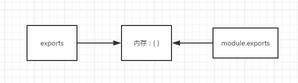

## day02 的 Node 学习

### Node 模块的导入导出

NodeJS 采用的是 CommonJS 规范，在 NodeJS 中，一般将代码合理拆分到不同的 JS 文件中，每一文 件都是一个模块，而文件路径就是模块名。

在编写模块时，都有 require、exports、module 这三个预先定好的变量可提供使用。

> NodeJS 中的模块分类：

- 核心模块（已经封装好的内置模块）；
- 自己定义的模块；
- 第三方模块（npm 下载的）；

1. **requrie**

   `require` 函数用来在一个模块引入另外一个模块。传入一个模块名，返回一个模块导出对象。
   用法：

```js
let 变量名 = require("模块名");
```

其中模块名可以用绝对路径也可以用相对路径，模块的后缀名.js 可以省略

```js
let page1 = require("./main.js");
let page2 = require("./main");
```

require()函数有两个作用：

- 执行导入的模块中的代码。
- 返回导入模块的接口对象。

2. **exports**

`exports` 对象用来导出当前模块的公共方法或属性，别的模块通过 require 函数使用当前模块时得到的就是当前模块的 exports 对象。
用法：

```js
exports.name = name/function;
```

name 为导出的对象名

```js
exports.add = function () {
  let sum = 0;
  console.log(++sum);
};
```

> 其实 exports 类似于 ES6 中的 export 的用法，用来导出一个指定名字的对象
> module.epxorts 可以导出一个对象也可以只导出一个字符串，而 exports 只能通过 exports.属性名 = 值；

先解释 exports 和 module.exports
​ 在一个 node 执行一个文件时，会给这个文件内生成一个 exports 和 module 对象，
​ 而 module 又有一个 exports 属性。他们之间的关系如下图，都指向一块{}内存区域。

```js
exports = module.exports = {};
```



> 其实 require 导出的内容是 module.exports 的指向的内存块内容，并不是 exports 的。
> 简而言之，区分他们之间的区别就是 exports 只是 module.exports 的引用，辅助后者添加内容用的。

3. module.epxorts

`module.exports`用来导出一个默认对象。没有指定对象名，常见于修改模块的原始导出对象。

4. 模块的初始化

一个模块在 JS 代码中记载模块**第一次被使用时**执行一次，并且在使用的过程中进行`初始化`。之后缓存起来便于后续使用

5. 主模块

通过命令行参数传递给 NodeJS 以启动程序的模块被称之为主模块。主模块负责调度组成整个程序的其它模块完成工作。

```js
node app.js // 或使用nodemon
nodemon app.js // app.js为启动程序
```

### npm 下包

Node.js 中使用 CommonJS 模块化机制，通过 npm 下载第三方包，项目中引入第三方包都是：let xxx = require("第三方包名")；

1. require("第三方包名")有限在加载包的模块的统计目录 node_modules 中查找第三方包

```js
npm init -y
```

首先得初始化包的设置

2. 找到该第三方包的 package.json 文件，并且找到里面的 main 属性对应的入口模块，该入口模块即为加载的第三方模块。


```json
{
  "name": "01.ImportOrExports", // 所在文件夹下的名称
  "version": "1.0.0", // 版本
  "description": "", //
  "main": "01.aaa.js", // 运行的对应入口文件
  "scripts": {
    "test": "echo \"Error: no test specified\" && exit 1"
  }, // 运行脚本
  "dependencies": {}, // 包的相关依赖
  "devDependencies": {}, // 开发时的相关依赖
  "keywords": [], // 关键字
  "author": "Sue", // 作者
  "license": "ISC" // 许可
}
```

### NPM 常用命令

`npm`英文名称：`node package manager`, npm 是世界上最大的软件注册表，包的结构使我们能够轻松使用追踪依赖和版本。

常用命令如下：

1. `npm -v`：查看 npm 版本
2. `npm init`：初始化后出现一个 `package.json` 配置文件。可以在后面加上-y，直接快速跳过问答式界面
3. `npm install`：会根据项目的 package.json 文件自动下载项目所需的所有依赖
4. `npm install 包名 --save-dev（npm install 包名 -D）`：安装的包需要发布到开发环境的，会出现在 package.json 文件中的 `devDependencies` 属性中
5. `npm install 包名 --save（npm install 包名 -S）`：安装的包需要发布到生产环境的，会出现在 package.json 文件中的 `dependencies` 属性中
6. `npm list`： 查看当前目录下已安装的 node 包
7. `npm list -g`：查看全局已经安装的 node 包
8. `npm --help`：查看帮助指令
9. `npm update 包名`：指定更新包
10. `npm uninstall 包名`：卸载指定包
11. `npm config list`： 查看配置信息
12. `npm 指定命令 --help`： 查看指定命令帮助
13. `npm info 指定包名`： 查看远程 npm 上指定包的所有版本信息
14. `npm config set register 网址（镜像网址）`：修改包下载源
15. `npm root`：查看当前包的安装路径
16. `npm root -g`：查看全局包的安装路径
17. `npm ls 包名`：查看本地安装的指定包及版本信息，没有显示 empty
18. `npm ls 包名 -g`：查看全局安装的指定包及版本信息，没有显示 empty

### Node - 文件的读取

> **在 `node` 中所有的执行都是异步的**

1. fs.openSync / fs.open ：同步/异步的方式打开一个文件
   其中 mode 有这些方法：
   `a`: 打开文件用于追加。 如果文件不存在，则创建该文件。
   `ax`: 类似于 'a'，但如果路径存在，则失败。
   `a+`: 打开文件用于读取和追加。 如果文件不存在，则创建该文件。
   `ax+`: 类似于 'a+'，但如果路径存在，则失败。
   `as`: 打开文件用于追加（在同步模式中）。 如果文件不存在，则创建该文件。
   `as+`: 打开文件用于读取和追加（在同步模式中）。 如果文件不存在，则创建该文件。
   `r`: 打开文件用于读取。 如果文件不存在，则会发生异常。
   `r+`: 打开文件用于读取和写入。 如果文件不存在，则会发生异常。
   `rs+`: 打开文件用于读取和写入（在同步模式中）。 指示操作系统绕过本地的文件系统缓存。
   这对于在 NFS 挂载上打开文件时非常有用，因为它可以跳过可能过时的本地缓存。 它对 I/O 性能有非常实际的影响，因此不建议使用此标志（除非真的需要）。
   `w`: 打开文件用于写入。 如果文件不存在则创建文件，如果文件存在则截断文件。
   `wx`: 类似于 'w'，但如果路径存在，则失败。
   `w+`: 打开文件用于读取和写入。 如果文件不存在则创建文件，如果文件存在则截断文件。
   `wx+`: 类似于 'w+'，但如果路径存在，则失败。

> `Buffer` 该类用来创建一个专门存放二进制数据的缓存区

```js
const fs = require("fs");
// console.log(fs);

// 读写数据
// 异步地打开文件：fs.openSync(path,flag,calback)
// path: 代表你要读取或写入的文件所在目录
// flag: 代表你所要执行的操作
var fd = fs.openSync("./file.txt", "r");
console.log(fd); // 读取的内容为文件所在的内存
// 在内存中开辟空间
// 该类用来创建一个专门存放二进制数据的缓存区
var buf = Buffer.alloc(20);
console.log(buf); // <Buffer 00 00 00 00 00 00 00 00 00 00 00 00 00 00 00 00 00 00 00 00>
// 使用readFileSyns读取
// var content = fs.readFileSync("./file.txt", { flag: "r" }); // <Buffer 64 61 79 64 61 79 64 72 65 61 6d>
var content = fs.readFileSync("./file.txt", { flag: "r", encoding: "utf-8" });
console.log(content);
```

2. 直接使用 fs.readFileSyns / fs.readFile 读取文件
   fs.readFile(path: number, options: { encoding?: null;flag?: string;} callback: (err: NodeJS.ErrnoException, data: Buffer) => void): void

- 第一个参数：读取文件路径
- 第二个参数：编码
- 第三个参数：回调函数返回错误信息和文件内容

```js
fs.readFile("./file.txt", "utf-8", (err, data) => {
  if (err) {
    console.error(err);
    return;
  }
  console.log(data);
});
```

封装读取文件的方法：

```js
// 封装readFile异步方法
// 使用promise封装，为了不用每次都重新写一遍方法直接调用函数
function ReadFS(path) {
  // 返回promise实例
  return new Promise(function (resolve, reject) {
    fs.readFile(path, { flag: "r", encoding: "utf-8" }, (err, data) => {
      if (err) {
        // 失败时的的报错
        reject(err);
        return;
      }
      // 成功的返回
      resolve(data);
    });
  });
}
// 使用async和await
// 　  async/await是写异步代码的新方式，以前的方法有回调函数和Promise。
// 　　async/await是基于Promise实现的，它不能用于普通的回调函数。
// 　　async/await与Promise一样，是非阻塞的。
// 　　async/await使得异步代码看起来像同步代码
async function getFile() {
  let FirstFile = await ReadFS("./file.txt");
  console.log(FirstFile);
}
getFile();
```

### Node - 文件的写入

1. 使用 fs.writeFile / writeFileSync(path,data,{opotions},callback)的方法

- path 参数：写入文件路径
- data 参数：写入内容
- {options}参数：可选参数有 flag 和 encoding 等属性
- callback 参数：回调函数返回失败结果

```js
const fs = require("fs");

fs.writeFile(
  "file.txt", // 路径
  "Infected", // 内容
  { flag: "w", encoding: "utf-8" }, // flag 、 编码
  (err) => {
    // 回调函数
    if (err) {
      console.log("写入文件出错");
    }
    console.log("写入成功");
  }
);
```

缺点：每一此这么写会将之前的内容覆盖

所以将 flag 的 w 替换为 a 即可，a 代表着追加

```js
const fs = require("fs");

fs.writeFile(
  "file.txt", // 路径
  "Infected\n", // 内容
  { flag: "a", encoding: "utf-8" }, // flag使用a 、 编码
  (err) => {
    // 回调函数
    if (err) {
      console.log("写入文件出错");
    }
    console.log("写入成功");
  }
);
```

封装写入文件的方法

```js
function WriteFS(path, content) {
  return new Promise(function (resolve, reject) {
    fs.writeFile(path, content, { flag: "a", encoding: "utf-8" }, (err) => {
      if (err) {
        reject(err);
        // console.log("写入文件出错");
      }
      resolve("写入成功");
      // console.log("写入成功");
    });
  });
}

async function writeList() {
  // 如果没找到文件会自动生成
  let first = await WriteFS("write.txt", "1.学习\n");
  console.log(first);
  let second = await WriteFS("write.txt", "2.考研\n");
  console.log(second);
  let third = await WriteFS("write.txt", "3.进步\n");
  console.log(third);
}
writeList();
```

### Node - 删除文件

使用：fs.unlink(path,callback)

```js
const fs = require("fs");

fs.unlink("hhh.js", () => {
  console.log("删除成功");
});
```

### Node - Buffer 缓存区操作

1.Node.js Buffer(缓冲区)
     为了处理 TCP 流或文件流，Node.js 定义的类，专门用来存放二进制数据的缓存区。
     一个 Buffer 类类似于一个整数数组，但它对应于 V8 堆内存之外的一块原始内存。
     建议使用 Buffer.from()接口去创建 Buffer 对象。
    Buffer.from(array)，传入的 array 的元素只能是数字，不然就会自动被 0 覆盖。
    buf.toString()读取缓冲区数据。
     将 Buffer 转换为 JSON 对象 buf.toJSON()。将字符串转为 Buffer 实例时，JSON.stringify 会隐式地掉用 toJSON()。
     缓冲区合并：Buffer.concat(list, [totalLength]（指定合并后 Buffer 对象的总长度）)。     返回一个多个成员合并后的新 Buffer 对象。
     缓冲区比较：buf.conpare(otherBuffer); 返回一个数字，表示 buf 在 otherBuffer 之前、之后或相同。
     拷贝缓冲区：buf.copy(targetBuffer, [targetStart]); 没有返回值。
     缓冲区裁剪：buf.slice([start, end]); 返回一个新的缓冲区。

JavaScript 语言自身只有字符串数据类型，没有二进制数据类型。

并且 JS 数组是以链式存储的方式实现的，其内存空间并不是连续不间断的

但在处理像 TCP 流或文件流时，必须使用到二进制数据。因此在 Node.js 中，定义了一个 Buffer 类，该类用来创建一个专门存放二进制数据的缓存区。

1. Buffer.from(str) 查看其内存地址

```js
var str = "instroduce";
const buf = Buffer.from(str);
console.log(buf); // <Buffer 69 6e 73 74 72 6f 64 75 63 65> 十六进制
```

2. Buffer.alloc(size,fill,[encoding]) 设置一个内存空间

```js
// 用于预填充新 Buffer 的值
const buf = Buffer.alloc(10); // 开辟一个10个字符的内存空间
console.log(buf);
```

3. Buffer.allocUnsafe(size) 开辟一个不安全的内存空间

```js
const buf = Buffer.allocUnsafe(10); // 开辟一个10个字符的内存空间
console.log(buf); // <Buffer b8 31 a1 af 7e 01 00 00 c8 a9>
```
