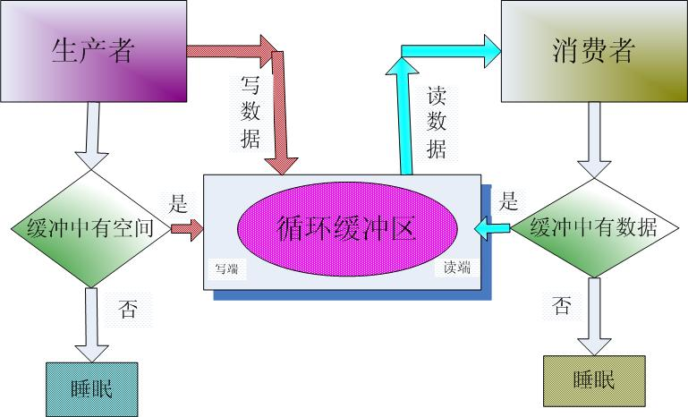
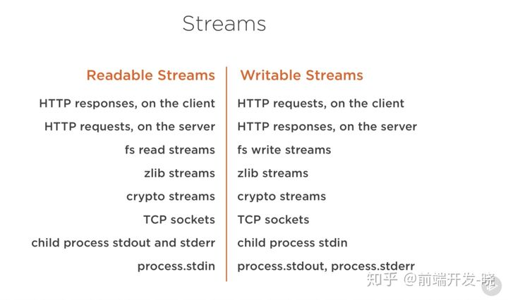
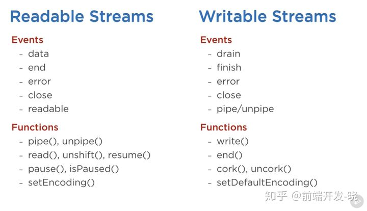
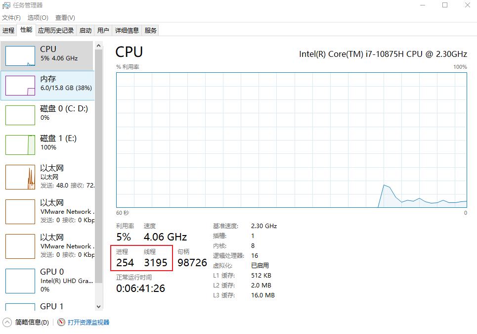
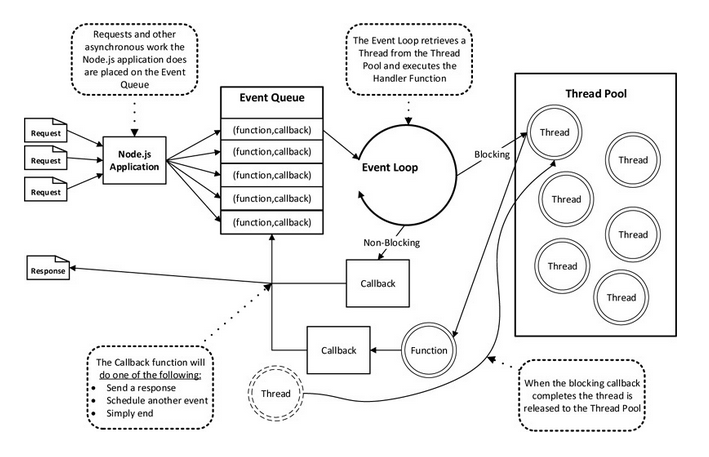
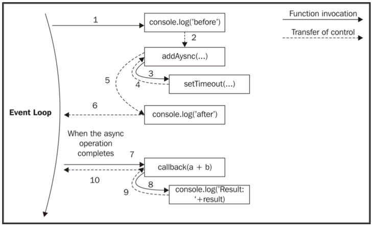
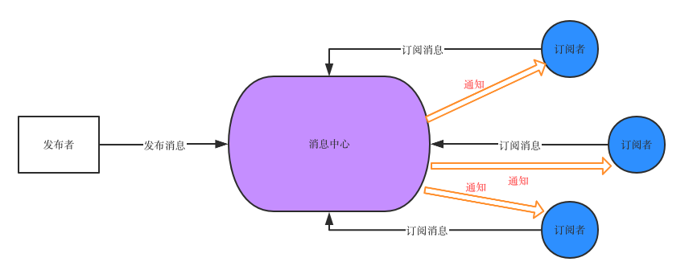

## day04-Node 学习笔记



### 到底什么是流(Stream)？

流是数据的集合 - 就像数组或者字符串。
差异就是流可能不是一次性获取到的，它们不需要匹配内存。
这让流在处理大容量数据，或者从一个额外的源每次获取一块数据的时候变得非常强大。

然而，流不仅可以处理大容量的数据。
它们也给了我们在代码中组合的能力。
就像在我们可以通过导入其他一些更小的 Linux 命令那样组合出强大的 Linux 命令。

**很多在 Node.js 内置的模块都实现了流接口：**



上面列表中有些原生的 Node.js 对象是可读和可写的流，它们中的一些即是可读的也是可写的流，比如 TCP sockets，zlib，crypto 流。

注意对象也是紧密相关的。在客户端的 HTTP response 是可读的，而在服务器端是可写的。
因为在 HTTP 例子中，我们基本上是从一个对象（http.IncomingMessage）里面读数据并且往另一个里面（http.ServerResponse）写数据。

注意，当出现子进程时，子进程的标准输入输出流（stdin，stdout，stderr）有着相反的流类型。
这允许以非常方便的方式从主进程输入输出流导入到子进程的输入输出流中。

**语法：写入流**

```js
const fs = require("fs");
// createWriteStream写入流（文件路径，options选项）
// 一个对象中包含了很多方法
var ws = fs.createWriteStream("test.txt", { flags: "w", encoding: "utf-8" });
// console.log(ws);
// 文件打开
ws.on("open", () => {
  console.log("1-文件打开了");
});
// 在文件中写入相应内容
ws.write("HelloWorld \n", (err) => {
  if (err) {
    console.error(err);
  }
  console.log("2-内容以写入");
});
// 文件关闭
ws.on("close", () => {
  console.log("3-文件关闭了");
});
// 文件结束
ws.end(() => {
  console.log("4-文件结束了");
});
```

**读取流并重新写入：**

```js
// 1. 引入fs模块
const { on } = require("events");
const fs = require("fs");

// 创建读取流createReadStream（文件路径，{options配置}）
let rs = fs.createReadStream("./Aimer - カタオモイ.flac", {
  flags: "r",
});
// 创建写入流
var ws = fs.createWriteStream("./单相思-Aimer.flac", {
  flags: "w",
});

// 1. 打开文件
rs.on("open", () => {
  console.log("1. 文件打开");
});

// 查看文件流出情况
rs.on("data", (chunk) => {
  console.log(`单次流出数据量：${chunk.length}`);
  console.log(chunk);
  ws.write(chunk, (err) => {
    if (err) {
      console.error(err);
    }
    console.log("文件写入成功");
  });
});

//2. 文件关闭
rs.on("close", () => {
  ws.end();
  console.log("2. 文件关闭");
});
```

### Streams 101

在 Node.js 中有四种基本的流类型：Readable（可读流），Writable（可写流），Duplex（双向流），Transform（转换流）。

- 可读流是数据可以被消费的源的抽象。一个例子就是 fs.createReadStream 方法。
- 可读流是数据可以被写入目标的抽象。一个例子就是 fs.createWriteStream 方法。
- 双向流即是可读的也是可写的。一个例子是 TCP socket。
- 转换流是基于双向流的，可以在读或者写的时候被用来更改或者转换数据。一个例子是 zlib.createGzip 使用 gzip 算法压缩数据。你可以将转换流想象成一个函数，它的输入是可写流，输出是可读流。你或许也听过将转换流成为“通过流（through streams）”。

所有的流都是 EventEmitter 的实例。触发它们的事件可以读或者写入数据，然而，我们可以使用 pipe 方法消费流的数据。

### Stream 事件

除了从一个可读源流读取和往一个目标流中写入数据，pipe 方式自动管理一些事情。例如，处理错误，文件末尾，或者当一个流比另一个快或者满的情形。

然而，流可以被事件直接消费。这里有一个 pipe 方法读取数据等价的使用事件消费流的代码：

```js
# readable.pipe(writable)
readable.on('data', (chunk) => {
  writable.write(chunk);
});
readable.on('end', () => {
  writable.end();
});
```

这里有一个被可读流和可写流使用的重要事件和函数列表：



事件和函数是某种方式相关的，因为它们可以一起使用。

在可读流上最重要的事件有：

- data 事件，当流传递给消费者一个数据块的时候会触发。
- end 事件，当在流中没有可以消费的数据的时候会触发。

在可写流上面最重要的事件有：

- drain 事件，当可写流可以接受更多的数据时的一个标志。
- finish 事件，当所有的数据都写入到底层系统中时会触发。

事件和函数可以结合起来自定义和优化流的使用。为了消费一个可读流，我们可以使用 pipe/unpipe 方法，或者 read/unshift/resume 方法。为了消费一个可写流，我们可以将它作为 pipe/unpipe 的目标，或者使用 write 方法写入，当我们完成的时候调用 end 方法。

### Node 的事件循环

Node.js 时单进程单线程应用程序，但是因为 V8 引擎的提供异步执行回调接口，通过这些接口可以处理大量的并发，所以性能很高（`进程时资源分配的基本单位，线程时独立调度的基本单位`）

**进程**是具有一定独立功能的程序关于某个数据集合上的一次运行活动,进程是系统进行资源分配和调度的一个独立单位.

**线程**是进程的一个实体,是 CPU 调度和分派的基本单位,它是比进程更小的能独立运行的基本单位.线程自己基本上不拥有系统资源,只拥有一点在运行中必不可少的资源(如程序计数器,一组寄存器和栈),但是它可与同属一个进程的其他的线程共享进程所拥有的全部资源.



Node.js 几乎每一个 API 都支持回调函数

Node.js 基本上多有的事件机制都是用设计模式观察者模式实现的

Node.js 单线程类似进入一个 while（true） 的事件循环，知道没有事件观察者退出，每个异步事件都生成一个事件观察者，如果有事件发生就调用该回调函数

### 事件驱动程序

Node.js 使用事件驱动模型，当 web server 接收到请求，就把它关闭然后进行处理，然后去服务下一个 web 请求

当这个请求完成，它被放回处理队列，当到达队列开头，这个结果就会返回给用户

这个模型十分高效可扩展性强，因为 web sever 一直接收请求而不等待任何读写操作。（被称之为非阻塞式 IO 或者事件驱动 IO）

在事件驱动模型中，会生成一个主循环来监听事件，当检测到事件时触发回调函数。


整个事件驱动的流程就是这么实现的，非常简洁。有点类似于观察者模式，事件相当于一个主题(Subject)，而所有注册到这个事件上的处理函数相当于观察者(Observer)。

Node.js 有多个内置的事件，我们可以通过引入 events 模块，并通过实例化 EventEmitter 类来绑定和监听事件

**简单总节：**

1. Node 是一个单线程的语言，**采用事件驱动和异步回调的机制**。在执行代码的时候，主线程从**上往下依次执行**，遇到有需要回调的地方，就将此处**加入到事件队列**中，然后主线程继续往下走，直到运行结束以后，才去执行事件队列中的回调
2. node 去执行事件队列中的事件时，如果遇到回调，依然是按照顺序添加进入事件队列，主线程一次往下执行，遇到回调就添加，直至执行完毕。
3. node 是一个单线程多进程的。node 进程创建一个循环，每个循环就是一个周期，在循环中会从事件队列里查看是否有事件需要处理，如果有就去除事件并执行相关的函数。对于阻塞事件的处理在幕后使用线程池来确保工作的运行，而不占用主循环流程。

**NodeJS 非阻塞机制：**



**Node.js 中事件循环过程:**



**观察者模式--订阅，发布模式：**



> 1.  消息中心：负责存储消息与订阅者的对应关系，有消息触发时，负责通知订阅者
> 2.  订阅者：去消息中心订阅自己感兴趣的消息
> 3.  发布者：满足条件时，通过消息中心发布消息

**原生书写：订阅，发布模式（观察者模式）**

```js
const fs = require("fs");

fs.readFile(
  "Hello.txt",
  { flag: "r", encoding: "utf-8" },
  function (err, data) {
    if (err) {
      console.log(err);
    } else {
      console.log(data);
      sEvent.emit("fileSuccess", data);
    }
  }
);

// Event
let sEvent = {
  event: {
    // fileSuccess: [],
  },
  on: function (eventName, eventFn) {
    if (this.event[eventName]) {
      this.event[eventName].push(eventFn);
    } else {
      this.event[eventName] = [];
      this.event[eventName].push(eventFn);
    }
  },
  emit: function (eventName, eventMsg) {
    if (this.event[eventName]) {
      this.event[eventName].forEach((item) => {
        item(eventMsg);
      });
    }
  },
};

// 1. 获取所有信息
sEvent.on("fileSuccess", function (eventMsg) {
  console.log("1. 成功获取所有信息");
});
// 2. 统计
sEvent.on("fileSuccess", function (eventMsg) {
  console.log("2. 成功统计");
});

// 3.详细信息
sEvent.on("fileSuccess", function (eventMsg) {
  console.log("3. 成功获取详细信息");
});
```

**使用 Node 模块 events 书写：**

```js
// 引入 events 模块
const events = require("events");
// console.log(events);

// 创建 eventEmitter 对象
const eventEmitter = new events.EventEmitter();

// 创建事件处理程序
var connectHandler = function connected() {
  console.log("1. 连接成功......");
  eventEmitter.emit("data_received");
};

// 绑定 connection 事件处理程序
eventEmitter.on("connection", connectHandler);

// 使用匿名函数绑定 data_received 事件
eventEmitter.on("data_received", function () {
  console.log("数据接收成功......");
});

// 触发 connection 事件
eventEmitter.emit("connection");

console.log("程序执行完毕");
```
