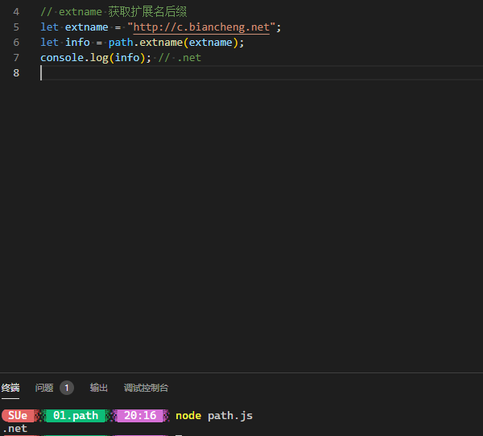
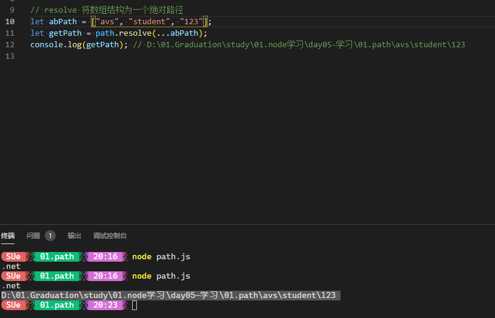
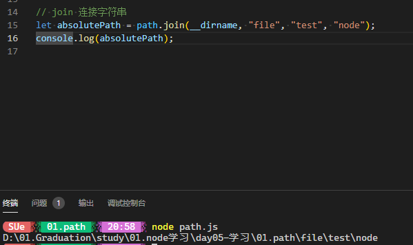
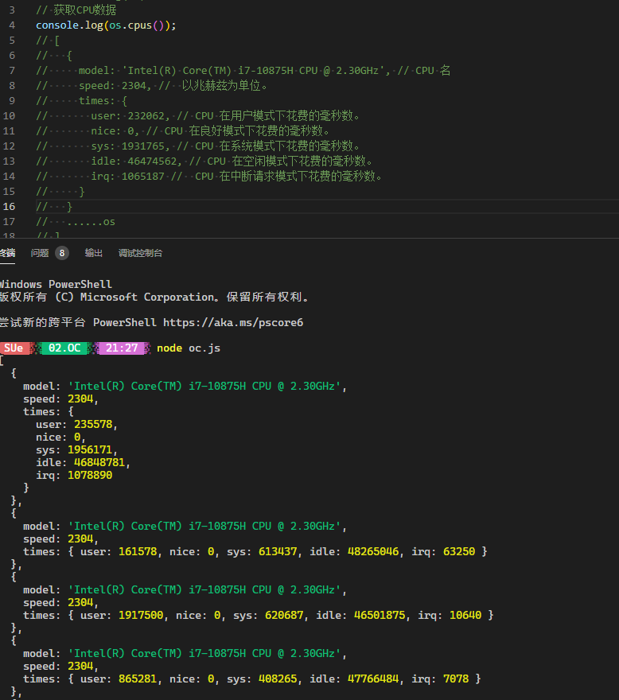
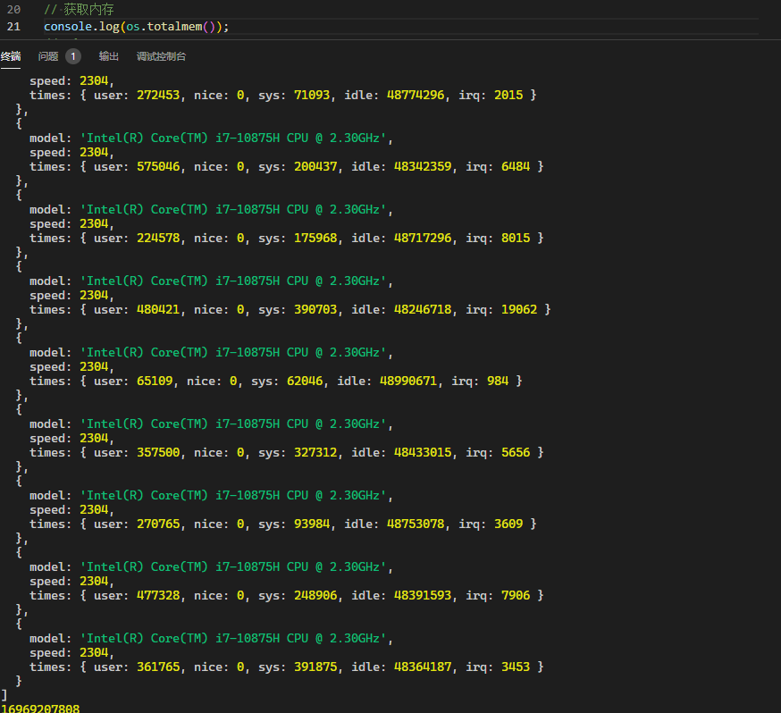
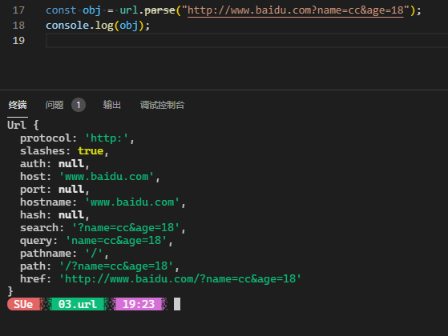

## day05-Node 学习笔记

### Node 的核心模块 OS 和 path

Node.js 中`path`模块提供了操作路径的 API，`os` 模块中提供了一些操作系统的相关 API。

1. `path`

   - `path.extname()` 获取文件（可以是一个文件路径）的扩展名：

   ```js
   // path所有方法
   {
     resolve: [Function: resolve],
     normalize: [Function: normalize],
     isAbsolute: [Function: isAbsolute],
     join: [Function: join],
     relative: [Function: relative],
     toNamespacedPath: [Function: toNamespacedPath],
     dirname: [Function: dirname],
     basename: [Function: basename],
     extname: [Function: extname],
     format: [Function: bound _format],
     parse: [Function: parse],
     sep: '\\',
     delimiter: ';',
     win32: [Circular *1],
     posix: <ref *2> {
       resolve: [Function: resolve],
       normalize: [Function: normalize],
       isAbsolute: [Function: isAbsolute],
       join: [Function: join],
       relative: [Function: relative],
       toNamespacedPath: [Function: toNamespacedPath],
       dirname: [Function: dirname],
       basename: [Function: basename],
       extname: [Function: extname],
       format: [Function: bound _format],
       parse: [Function: parse],
       sep: '/',
       delimiter: ':',
       win32: [Circular *1],
       posix: [Circular *2],
       _makeLong: [Function: toNamespacedPath]
     },
     _makeLong: [Function: toNamespacedPath]
   }
   ```

   ```js
   // extname 获取扩展名后缀
   let extname = "http://c.biancheng.net";
   let info = path.extname(extname);
   console.log(info); // .net
   ```

   

   - `path.resolve([...path])` 把一个路径或者路径片段的序列借此为一个绝对路径。

   ```js
   // resolve 将数组结构为一个绝对路径
   let abPath = ["avs", "student", "123"];
   let getPath = path.resolve(...abPath);
   // 结构为当前目录下的文件地址
   console.log(getPath); // D:\01.Graduation\study\01.node学习\day05-学习\01.path\avs\student\123
   ```

   

   给定的路径序列是`从右到左` 被处理的，后面每个 path 被依次解析，直到构成一个绝对路径

   - `path.jion([...paths])` 方法使用平台特定的分隔符把全部给定的 path 片段连接到一起，并规范化为路径

   ```js
   // join 连接字符串
   let absolutePath = path.join(__dirname, "file", "test", "node");
   console.log(absolutePath); // D:\01.Graduation\study\01.node学习\day05-学习\01.path\file\test\node
   ```

   

   > `__dirname` : 获取当前执行文件所在目录的完整目录名
   > `__filenames` : 获取当前**执行文件**的带有完整绝对路径的文件命
   > `process.cwd()` : 获取当前执行**node 命令** 时候的文件夹目录经

2. `os`

   - `os.cpus()` 获取操作系统的 CPU 信息。

   ```js
   const os = require("os");
   console.log(os);
   ```

   

   - `os.totalmem()` 获取内存数据

   ```js
   console.log(os.totalmem()); // 16969207808
   ```

   

3. `url`

   - `url.parse()`: 方法可以解析一个 url 地址，通过传入第二个参数（true）把包含有查询字符串的 query 转换成对象

   ```js
   const obj = url.parse("http://www.baidu.com?name=cc&age=18");
   console.log(obj);
   ```

   ​ 
