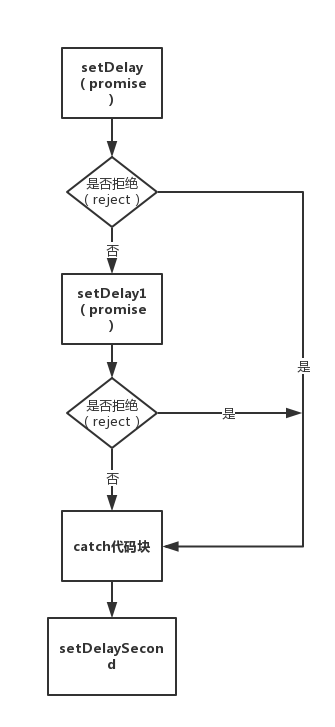

## 为什么会有 Async/Await

我们都知道已经有了 Promise 的解决方案了，为什么还要 ES7 提出新的 Async/Await 标准呢？

答案其实也显而易见：Promise 虽然跳出了异步嵌套的怪圈，用链式表达更加清晰，但是我们也发现如果有大量的异步请求的时候，流程复杂的情况下，会发现充满了屏幕的 then，看起来非常吃力，而 ES7 的 `Async/Await` 的出现就是为了解决这种复杂的情况。

首先，我们必须了解 `Promise`。

## Promise 简介

`Promise` 是异步编程的一种解决方案，比传统的解决方案——回调函数和事件——更合理和更强大。它由社区最早提出和实现，ES6 将其写进了语言标准，统一了用法，原生提供了 `Promise` 对象。

所谓 `Promise`，简单说就是一个容器，里面保存着某个未来才会结束的事件（通常是一个异步操作）的结果。从语法上说，`Promise` 是一个对象，从它可以获取异步操作的消息。`Promise` 提供统一的 API，各种异步操作都可以用同样的方法进行处理。

Promise 对象有以下两个特点:

（1）对象的状态不受外界影响。`Promise` 对象代表一个异步操作，有三种状态：pending（进行中）、resolve（已成功）和 rejected（已失败）。只有异步操作的结果，可以决定当前是哪一种状态，任何其他操作都无法改变这个状态。这也是 `Promise` 这个名字的由来，它的英语意思就是“承诺”，表示其他手段无法改变。

（2）一旦状态改变，就不会再变，任何时候都可以得到这个结果。`Promise` 对象的状态改变，只有两种可能：从 pending 变为 resolved 和从 pending 变为 rejected。只要这两种情况发生，状态就凝固了，不会再变了，会一直保持这个结果，这时就称为 resolved（已定型）。如果改变已经发生了，你再对 Promise 对象添加回调函数，也会立即得到这个结果。这与事件（Event）完全不同，事件的特点是，如果你错过了它，再去监听，是得不到结果的。

有了 `Promise` 对象，就可以将异步操作以同步操作的流程表达出来，避免了层层嵌套的回调函数。此外，`Promise` 对象提供统一的接口，使得控制异步操作更加容易。

`Promise` 也有一些缺点。首先，无法取消 `Promise`，一旦新建它就会立即执行，无法中途取消。其次，如果不设置回调函数，`Promise` 内部抛出的错误，不会反应到外部。第三，当处于 pending 状态时，无法得知目前进展到哪一个阶段（刚刚开始还是即将完成）。

### 1.1 Promise 实例

```js
const setDelay = (time) => {
  return new Promise((resolve, reject) => {
    if (typeof time != "number") reject(new Error("参数必须是Number类型"));
    setTimeout(() => {
      resolve(`我延迟了${time}毫秒后输出的`);
    }, time);
  });
};
```

我们把一个 Promise 封装在一个函数里面同时返回了一个 Promise，这样比较规范。

可以看到定义的 Promise 有两个参数，resolve 和 reject。

- `resolve`：将异步的执行从 pending(请求)变成了 resolve(成功返回)，是个函数执行返回。
- `reject`：顾名思义“拒绝”，就是从请求变成了"失败"，是个函数可以执行返回一个结果，推荐返回一个错误 new Error()。

### 1.2 Promise 的 then 和 catch

我们通过 `Promise` 的原型方法 `then` 拿到我们的返回值：

```js
setDelay(2000).then((success) => {
  console.log(success); // 输出“我延迟了2000毫秒后输出的”
});
```

如果需要捕获错误信息使用 `catch`:

```js
setDelay("我是字符串")
  .then((result) => {
    console.log(result); // 不进去了
  })
  .catch((err) => {
    console.log(err); // 输出错误：“参数必须是number类型”
  });
```

### 1.3 Promise 互相依赖

```js
const setDelaySecond = (seconds) => {
  return new Promise((resolve, reject) => {
    if (typeof seconds != "number" || seconds > 10)
      reject(new Error("参数必须是number类型，并且小于等于10"));
    setTimeout(() => {
      console.log(
        `先是setDelaySeconds函数输出，延迟了${seconds}秒，一共需要延迟${
          seconds + 2
        }秒`
      );
      resolve(setDelay(2000));
    }, seconds * 1000);
  });
};
```

在下一个需要依赖的 resolve 去返回另一个 Promise

```js
setDelaySecond(3)
  .then((result) => {
    console.log(result);
  })
  .catch((err) => {
    console.log(err);
  });
```

结果是先执行：“**先是 setDelaySeconds 输出，延迟了 2 秒，一共需要延迟 5 秒**”

再执行 setDelay 的 resolve：“**我延迟了 2000 毫秒后输出的**”。的确做到了依次执行的目的。

想先执行 setDelay 函数再执行 setDelaySecond，但不想用上面那种写法

### 1.4 Promise 的链式写法

```js
const setDelaySecond = (seconds) => {
  return new Promise((resolve, reject) => {
    if (typeof seconds != "number" || seconds > 10)
      reject(new Error("参数必须是number类型，并且小于等于10"));
    setTimeout(() => {
      // console.log(`先是setDelaySeconds函数输出，延迟了${seconds}秒，一共需要延迟${seconds + 2}秒`)
      resolve(`我延迟了${seconds}秒后输出的，是第二个函数`);
      // resolve(setDelay(2000))
    }, seconds * 1000);
  });
};
```

先执行 setDelay 在执行 setDelaySecond，只需要在第一个 then 的结果中**返回下一个 Promise 就可以一直链式写下去了，相当于依次执行**：

```js
setDelay(2000)
  .then((res) => {
    console.log(res);
    console.log("------First------");
    return setDelaySecond(3);
  })
  .then((res) => {
    console.log(res);
    console.log("-------Second-------");
  })
  .catch((err) => {
    console.log(err);
  });
```

### 1.5 Promise 链式写法的注意点

then 式链式写法的本质其实是一直往下传递返回一个新的 Promise，也就是说 then 在下一步接收的是上一步返回的 Promise。

那么并不是这么简单，then 的返回我们可以看出有 2 个参数(都是回调)：

1. 第一个回调是 resolve 的回调，也就是第一个参数用得最多，拿到的是上一步的 Promise 成功 resolve 的值。
2. 第二个回调是 reject 的回调，用的不多，但是求求大家不要写错了，通常是拿到上一个的错误，那么这个错误处理和 catch 有什么区别和需要注意的地方呢？

```js
setDelay(2000)
  .then((result) => {
    console.log(result);
    console.log("我进行到第一步的");
    return setDelaySecond(20);
  })
  .then(
    (result) => {
      console.log("我进行到第二步的");
      console.log(result);
    },
    (_err) => {
      console.log("我出错啦，进到这里捕获错误，但是不经过catch了");
    }
  )
  .then((result) => {
    console.log("我还是继续执行的！！！！");
  })
  .catch((err) => {
    console.log(err);
  });
```

结果是：进到了 then 的第二个参数（reject）中去了，而且最重要的是！不再经过 catch 了。
把 catch 挪上去，写到 then 错误处理前：

```js
setDelay(2000)
  .then((result) => {
    console.log(result);
    console.log("我进行到第一步的");
    return setDelaySecond(20);
  })
  .catch((err) => {
    // 挪上去了
    console.log(err); // 这里catch到上一个返回Promise的错误
  })
  .then(
    (result) => {
      console.log("我进行到第二步的");
      console.log(result);
    },
    (_err) => {
      console.log(
        "我出错啦，但是由于catch在我前面，所以错误早就被捕获了，我这没有错误了"
      );
    }
  )
  .then((result) => {
    console.log("我还是继续执行的！！！！");
  });
```

可以看到先经过 catch 的捕获，后面就没错误了。

注意点：

- catch 写法是针对于整个链式写法的错误捕获的，而 then 第二个参数是针对于上一个返回 Promise 的。
- 两者的优先级：就是看谁在**链式写法的前面**，在前面的先捕获到错误，后面就没有错误可以捕获了，链式前面的优先级大，而且两者都不是 break， 可以继续执行后续操作不受影响。



catch 只是捕获错误的一个链式表达，并不是 break！

所以，catch 放的位置也很有讲究，一般放在一些重要的、必须 catch 的程序的最后。这些重要的程序中间一旦出现错误，会马上跳过其他后续程序的操作直接执行到最近的 catch 代码块，但不影响 catch 后续的操作

## Async/await 介绍

什么是 async/await 呢？可以总结为一句话：async/await 是一对好基友，缺一不可，他们的出生是为 Promise 服务的。可以说 async/await 是 Promise 的进化版。
这两个基友必须同时出现，缺一不可，那么先说一下 Async：

```js
async function process() {}
```

上面可以看出，async 必须声明的是一个 function，不要去声明别的，要是那样 await 就不理你了（报错）。

```js
async function process() {
  let data = await project(100);
}
process();
```

### 1.1 async 本质

**async 声明的函数的返回本质上是一个 Promise。**

```js
(async function () {
  return "我是Promise";
})();
// 返回是Promise
//Promise {<resolved>: "我是Promise"}
```

等同于：

```js
(async function () {
  return Promise.resolve("我是Promise");
})();
```

```js
const demo = async function () {
  return Promise.resolve("我是Promise");
  // 等同于 return '我是Promise'
  // 等同于 return new Promise((resolve,reject)=>{ resolve('我是Promise') })
};
demo().then((result) => {
  console.log(result); // 这里拿到返回值
});
```

### 1.2 await 的本质与例子

`await` 的本质是**可以提供等同于”同步效果“的等待异步返回能力的语法糖**。
