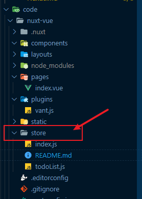

## NuxtJs 中的 Vuex 使用

首先一点，在 `Nuxt` 中我们无需再进行安装 `vuex` ，因为 `Nuxt` 已经报我们内置了 `Vuex` 直接在 `store` 文件中创建 JS 文件使用即可

### 使用方法：

示例：

~~~js
// 定义初始状态数据
export const state = ()=>{
    return {
        count:0
    }
}

// 定义同步方法
export const mutations = {
    ...
}

// 定义异步方法
export const actions = {
    ...
}

// 定义计算属性
export const getter = {
    ...
}
~~~

**在配置每一项的时候都需要 export 导出，否则 Nuxt 无法判断我们是否使用了 Vuex**

### 如何显示 Vuex 中的数据和调用方法

1. 显示数据

**方法一：使用this.$store.state.xxx**

~~~html
 <h3>{{ this.$store.state.count }}</h3>
~~~

**方法二：mapState**

~~~vue

~~~

2. 调用同步方法

**方法一：使用this.$store.commit("store中的同步方法名"，[可选传参])**

~~~vue

~~~

**方法二：mapMutations**

~~~vue

~~~

3. 调用异步方法

**方法一：使用this.$store.dispatch("store中的异步方法名"，[可选传参])**

~~~vue

~~~

**方法二：mapActions**

~~~vue

~~~