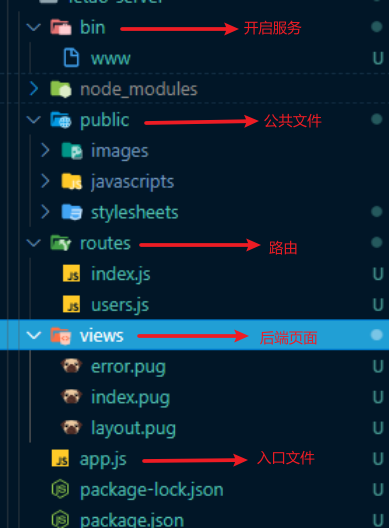

## 乐淘项目

**目标：**

1. 看设计稿，需要哪些接口以及接口功能
2. 设计数据库表和字段
3. KOA完成接口开发，使用postman测试

**实现思路：**

1. 项目有：首页、分类页、购物页、会员中心
2. 所需接口（首页）：
   1. `banners`：首页轮播图数据
   2. `gridList`：宫格数据
   3. `sportList`：提供运动专区数据
   4. `brandList`：品牌专区数据
3. 所需接口（分类页）：
   1. `oneCategoryList`：一级分类列表数据
   2. `twoCategoryList`：二级分类列表数据（根据一级分类的ID获取数据）

### 项目的初始化

1. 安装 KOA 脚手架

~~~js
npm install -g koa-generator
~~~

2. 生成项目

~~~
koa2 letao-server
npm install
npm run dev
~~~

### KOA 目录结构

### MVC 和 MVVM 模式

#### MVC 架构模式

`MVC`: M-Model（数据），V-View（视图层），C-Controller（控制层）

- 模型（Model） - 程序员编写程序应有的功能（实现算法等等）、数据库专家进行数据管理和数据库设计(可以实现具体的功能)。
- 视图（View） - 界面设计人员进行图形界面设计。
- 控制器（Controller）- 负责转发请求，对请求进行处理。

**适用于后端开发模板**

#### MVVM 架构模式

`MVC`: M-Model（数据），V-View（视图层），VM-ViewModel

### 首页接口 开发

#### girdList 接口开发

**routes/index.js**

~~~js
const { girdList, Banner, Sports } = require("../controller/index");
// 1. girdList - 宫格数据
router.get("/girdlist", girdList);
~~~

**controller/index.js**

~~~js
module.exports.girdList = async (ctx) => {
  ctx.body = {
    status: 200,
    msg: [
      { id: 1, img_src: "/images/nav1.png" },
      { id: 2, img_src: "/images/nav2.png" },
      { id: 3, img_src: "/images/nav3.png" },
      { id: 4, img_src: "/images/nav4.png" },
      { id: 5, img_src: "/images/nav5.png" },
      { id: 6, img_src: "/images/nav6.png" },
    ],
  };
};
~~~

#### banner 接口开发

**routes/index.js**

~~~js
// 2. banner - 轮播图
router.get("/banner", Banner);
~~~

**controller/index.js**

~~~js
module.exports.Banner = async (ctx) => {
  ctx.body = {
    status: 200,
    msg: [
      { id: 1, img_src: "/images/banner1.png" },
      { id: 2, img_src: "/images/banner2.png" },
      { id: 3, img_src: "/images/banner3.png" },
      { id: 4, img_src: "/images/banner4.png" },
      { id: 5, img_src: "/images/banner5.png" },
    ],
  };
};
~~~

#### sports 接口开发

**routes/index.js**

~~~js
// 3. sportPart - 运动专区
router.get("/sports", Sports);
~~~

**controller/index.js**

~~~js
module.exports.Sports = async (ctx) => {
  ctx.body = {
    status: 200,
    msg: [
      {
        name: "adidas阿迪达斯 男式 场下休闲篮球鞋S83700",
        img: "/images/product.jpg",
        price: 1.0,
        oldPrice: 888.0,
      },
      {
        name: "FORUM 84 LOW 新款低帮经典运动鞋",
        img: "/images/product.jpg",
        price: 1.0,
        oldPrice: 899.0,
      },
      {
        name: "adidas阿迪达斯 男式 场下休闲篮球鞋S83700",
        img: "/images/product.jpg",
        price: 1.0,
        oldPrice: 888.0,
      },
      {
        name: "adidas阿迪达斯 男式 场下休闲篮球鞋S83700",
        img: "/images/product.jpg",
        price: 1.0,
        oldPrice: 888.0,
      },
    ],
  };
};
~~~

### Koa 连接 mysql

安装：

~~~git
npm install mysql --save
~~~

创建连接池,并将连接部分以promise的方式返回

**db/query.js**

~~~js
const mysql = require("mysql");

const { config } = require("../db/config");

var pool = mysql.createPool(config[process.env.DB_ENV]);

//TODO 第一步：封装链接mysql数据库的请求
module.exports.query = (sql, values) => {
  // 以 Promise 返回，这样可以以函数的形式调用并获取到其中的数据
  return new Promise((resolve, reject) => {
    pool.getConnection(function (err, connection) {
      if (err) throw err;
      // 根据sql语句查询，动态获取不同的sql语句用于连接
      connection.query(sql, values, function (error, results, fields) {
        // 连接上后拿到数据，释放连接
        connection.release();

        // 异常抛出
        if (error) throw reject(error);
        resolve(results);
      });
    });
  });
};
~~~

#### 创建一级路由

1. 首先在 route 文件中将对应的路由创建出来

~~~js
// TODO 第二步-开发接口并将请求数据操作放入 controller文件中
//#region 一级分类接口开发
router.get("/firstCategory", firstCategoryCrl);
//#endregion
~~~

2. 然后，在 controller 文件中创建对应文件用于输出数据

~~~js
const { firstCategoryModel } = require("../model/categoryModel");

// TODO 第三步-在控制层曾输出数据，并将操作数据的语句放入Model文件
//#region 一级路由
module.exports.firstCategoryCrl = async (ctx) => {
  // TODO 第五步-通过调用的方式获取到 model 中的数据
  const data = await firstCategoryModel();
  // console.log(data);
  // TODO 最后一步-将数据和状态码返回出去以便前台接收
  ctx.body = {
    code: 200,
    msg: data,
  };
};
//#endregion
~~~

3. 在 model 层操作数据

~~~js
const { query } = require("../db/query");

// TODO 第四步-将操作数据的方法放入到里面并将数据 return 出去
//#region  一级分类
module.exports.firstCategoryModel = async () => {
  var sql = "SELECT * FROM category";
  return await query(sql);
};
//#endregion
~~~

#### 二级路由（步骤同上）

**routes/category.js**

~~~js
const router = require("koa-router")();

const {
  firstCategoryCrl,
  secondCategoryCrl,
} = require("../controller/categoryCtrl");
//#region 二级分类接口开发
router.get("/secondCategory", secondCategoryCrl);
//#endregion
~~~

**controller/categoryCtrl.js**

~~~js
const {
  firstCategoryModel,
  secondCategoryModel,
} = require("../model/categoryModel");
//#region 二级级路由
module.exports.secondCategoryCrl = async (ctx) => {
  const { id } = ctx.request.query;
  console.log(id);
  const data = await secondCategoryModel(id);
  // console.log(data);
  ctx.body = {
    code: 200,
    msg: data,
  };
};
//#endregion
~~~

**model/categoryModel.js**

~~~js
//#region  二级分类
module.exports.secondCategoryModel = async (id) => {
  // 之后修改的话要改成 categoryId 用于关联一级分类
  var sql = "SELECT * FROM brand WHERE brand.categoryId = ?";
  return await query(sql, [id]);
};
//#endregion
~~~

### 用户注册

1. 创建用户数据表

~~~mysql
CREATE TABLE `user` (
  `id` int(11) NOT NULL AUTO_INCREMENT,
  `username` varchar(50) DEFAULT NULL, 
  `password` varchar(100) DEFAULT NULL,
  `mobile` char(11) DEFAULT NULL,
  `smscode` varchar(100) DEFAULT NULL,
  PRIMARY KEY (`id`)
) ENGINE=InnoDB AUTO_INCREMENT=1 DEFAULT CHARSET=utf8;
~~~

**route/user.js**

~~~js
const { registerCtrl } = require("../controller/userCtrl");
//#region 用户注册
router.get("/register", registerCtrl);
//#endregion
~~~

**controller/userCtrl.js**

~~~js
const { registerModel } = require("../model/userModel");

//#region 创建注册路由
module.exports.registerCtrl = async (ctx) => {
  const { username, password, mobile } = ctx.request.query;
  const data = await registerModel(username, password, mobile);
  ctx.body = {
    code: 200,
    msg: "注册成功",
  };
};
//#endregion
~~~

**model/userModel.js**

~~~js
const { query } = require("../db/query");

//#region register 用户注册
module.exports.registerModel = async (username, password, mobile) => {
  var sql = `INSERT INTO USER (username, password, mobile) VALUES ("${username}","${password}","${mobile}")`;
  return await query(sql);
};
//#endregion
~~~

#### Joi 表单校验

**app.js**

~~~js
// 配置动态环境部署
require("dotenv").config();
~~~

**controller/userCtrl.js**

~~~js
// 引入 joi 表单校验工具
const Joi = require("joi");

const { username, password, mobile } = ctx.request.body;
  console.log(username, password, mobile);
  //#region 表单参数校验
  const schema = Joi.object({
    username: Joi.string().min(4).max(20).required(),
    password: Joi.string()
      .pattern(/^[a-zA-Z0-9]{6,20}$/)
      .required(),
    repeat_password: Joi.ref("password"),
    mobile: Joi.string().pattern(
      /^1(3\d|4[5-9]|5[0-35-9]|6[2567]|7[0-8]|8\d|9[0-35-9])\d{8}$/
    ),
  });

  const verify = schema.validate({ username, password, mobile });

  if (verify.error) {
    ctx.body = {
      code: 0,
      msg: verify.error.details[0].message,
    };
    return;
  }
~~~